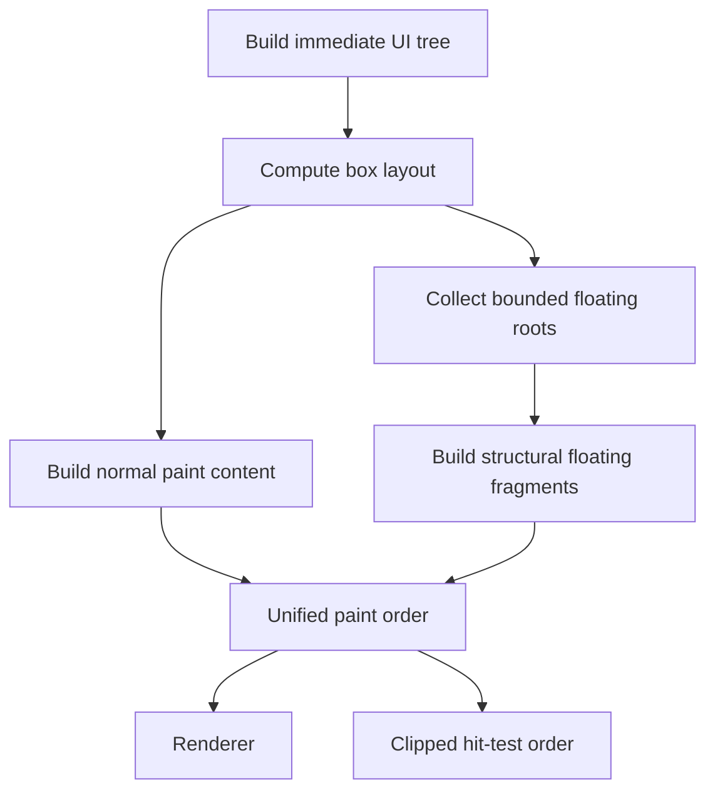

# Layout and Layering Design Direction

## Status

Proposal. This document records the current assessment and a deliberately small direction for improving layering correctness without replacing Gooey's Clay-inspired layout engine or expanding the public API unnecessarily.

## Goals

Gooey should provide both:

- A small, approachable API surface.
- Predictable, allocation-free, low-latency frame processing.

The current layout engine is a useful foundation. The proposed work is not a rewrite and does not attempt to reproduce GPUI's complete architecture. It adds only the minimum internal structure needed to keep painting, clipping, and input ordering consistent.

## Current Assessment

### Layout performance

The current benchmark suite was run with:

```sh
zig build bench
```

The benchmark target uses `ReleaseFast`. Representative results from one local run were:

| Scenario | Nodes | Layout only | Full frame |
| --- | ---: | ---: | ---: |
| Nested floating overlays | 385 | 0.027 ms | 0.026 ms |
| Wide siblings | 1,001 | 0.052 ms | 0.080 ms |
| Mixed layout | 5,051 | 0.213 ms | 0.352 ms |
| Nested vertical stack | 10,001 | 0.516 ms | 0.789 ms |
| Flex growth | 15,001 | 0.566–0.676 ms | 1.04–1.20 ms |

The tested cases cost approximately:

- 38–70 ns per node for layout.
- 65–83 ns per node for tree construction plus layout.

These results are encouraging and do not justify replacing the layout algorithm.

The benchmark suite does not currently establish:

- Allocation counts or allocated bytes.
- Tail latency such as p95 or p99.
- Performance under substantial text measurement and wrapping.
- Whole-frame rendering, input, focus, and accessibility costs.
- Behavior above the 16,384-element limit.
- A pass/fail regression threshold against a stored baseline.

Benchmark results should therefore be treated as evidence that the box-layout core is fast in the tested cases, not as proof that the complete UI pipeline is allocation-free or correct.

### Layout model

The Clay-inspired immediate layout model provides useful primitives:

- Fit, grow, fixed, percentage, and aspect-ratio sizing.
- Horizontal and vertical flow.
- Main-axis distribution and cross-axis alignment.
- Scroll containers.
- Out-of-flow anchored elements.
- Deterministic declaration order.

This model should remain. Clay-style box calculation and GPUI-style paint coordination address different layers of the framework and are not mutually exclusive.

### Current layering model

Floating elements are removed from ordinary flow, positioned in a separate pass, assigned a scalar `i16` z-index, and emitted into the same render-command list as ordinary content. When floating elements exist, individual commands are globally sorted by z-index and insertion order.

This combines several independent concerns:

1. Removal from normal layout flow.
2. Positioning relative to a parent or viewport.
3. Escaping ancestor clipping.
4. Painting above other content.
5. Receiving input above other content.

A single numeric z-index cannot fully express those relationships.

## Problems to Solve

### Paint and input ordering must agree

Ordinary layout commands, stateful text widgets, scrollbars, canvases, and direct widget hit tests do not all pass through one ordering and clipping model.

This can permit content behind an overlay to paint over it or receive input before it. The framework must derive painting and hit testing from the same effective order and clip information.

This is the foundational correctness requirement. Other overlay features are optional until applications require them.

### Global primitive sorting weakens structural guarantees

Sorting each rectangle, border, text command, and scissor command independently makes clipping behavior depend on sort results. Floating descendants can move beyond an ancestor's scissor pair, implicitly escaping that clip.

Escaping a scroll clip is often correct for a dropdown, but it should be an explicit policy rather than an accidental consequence of numeric sorting.

A floating subtree should retain its internal structural order and balanced clips.

### Additive z-index is not hierarchical ordering

Nested floating values are currently composed by addition. For example:

```text
Modal A                 1000
Modal A dropdown        1100
Later Modal B           1050
```

The dropdown belonging to Modal A can paint over the later Modal B. A nested stacking model would keep the complete subtree of Modal A below Modal B.

Gooey does not need CSS-compatible stacking contexts, but it should preserve overlay subtree boundaries.

### Numeric tiers leak implementation policy

Defaults such as 100 for popups, 200 for context menus, and 1000 for modals establish conventions that developers must learn and can accidentally violate. Declaration order and a small number of semantic categories are easier to reason about.

## Minimal Proposed Design

### Keep the public API small

The common API should remain preset-oriented:

```zig
.floating = ui.Floating.dropdown()
.floating = ui.Floating.tooltip()
.floating = ui.Floating.modal()
```

Most developers should not need to select numeric z-indexes, manage a portal, or understand the internal paint-fragment representation.

Advanced controls should be added only when real components require them.

### Use bounded paint fragments internally

Instead of globally sorting individual commands, collect floating roots into a fixed-capacity fragment list. A conceptual internal record is:

```zig
const PaintFragment = struct {
    root_element_index: u32,
    clip_bounds: BoundingBox,
    layer: PaintLayer,
    order: u16,
};
```

The exact representation may differ after implementation analysis. The required properties are:

- Fixed capacity allocated during initialization.
- Structural command order within a fragment.
- Balanced clip operations within a fragment.
- Stable declaration order within a layer.
- No per-frame allocation.
- The same fragment order available to hit testing.

Normal content can be one structural fragment or the direct base pass. Each floating root becomes a deferred structural fragment rather than a collection of independently sortable primitives.

### Use semantic layers

A small internal enum is sufficient initially:

```zig
const PaintLayer = enum(u8) {
    content,
    popup,
    modal,
    tooltip,
    drag,
};
```

The public presets select the appropriate layer. Stable declaration order resolves siblings within a layer.

A low-level local-order override should be added only if a concrete component cannot be expressed through semantic layers and declaration order.

Nested fragments must remain bounded by their containing overlay's order. A popup inside an earlier modal must not overtake a later modal merely because its local layer is higher than its parent content.

### Make clipping policy explicit

Only two policies are initially necessary:

```zig
const ClipPolicy = enum(u8) {
    inherit,
    viewport,
};
```

Typical defaults are:

- Ordinary out-of-flow element: `inherit`.
- Dropdown: `viewport`.
- Tooltip: `viewport`.
- Modal: `viewport`.

This separates removal from normal layout flow from escape out of ancestor clipping.

### Unify paint and hit records

Every visual or directly interactive item must participate in the same effective ordering model, including:

- Boxes and text emitted by the layout engine.
- Text inputs and text areas.
- Code editors.
- Scrollbars.
- Canvases and custom drawing.

Each hit region must at least know:

- Its effective bounds.
- Its effective clip.
- Its fragment or layer order.
- Its dispatch identity.

Painting and hit testing may use optimized representations, but they must derive equivalent order and clipping decisions from the same frame data.

## Intended Pipeline



The design should use linear passes over fixed-capacity storage. It should not require a retained scene graph, generalized portal framework, or global sort of all paint primitives.

## Non-Goals

The initial work does not need:

- A reproduction of GPUI's complete prepaint system.
- CSS-compatible stacking contexts.
- A generalized user-defined layer graph.
- Arbitrary cross-window portals.
- Collision-detection middleware.
- Tooltip arrows.
- Automatic placement fallback and flipping.
- Incremental retained layout.
- User-visible control over every internal paint tier.

Placement fallback, anchor IDs, and richer portal behavior can be added later when component requirements justify them.

Focus scopes are important before describing modals and menus as production-complete, but they do not need to be implemented inside the layout engine or block the initial paint-order correction.

## Implementation Order

### 1. Establish correctness tests

Add tests that prove:

- A text input behind a modal cannot paint or receive input above it.
- A text widget inside a scroll container obeys the effective scroll clip.
- Floating content uses its declared clip policy.
- A popup inside an earlier modal remains below a later modal.
- Paint order and hit-test order select the same topmost item.
- Fragment and command capacity overflow fails immediately in every build mode.

These tests should describe their goal and methodology at the top, following the engineering notes.

### 2. Unify special widget ordering

Move stateful text widgets, scrollbars, canvases, and other special rendering into the common paint-order model. Remove or adapt direct hit-test paths that bypass the ordered dispatch representation.

### 3. Introduce fixed-capacity paint fragments

Collect and emit floating subtrees as bounded fragments while preserving structural order. Validate command and fragment capacities before writing.

### 4. Replace additive z-index composition

Map presets to semantic layers and stable order. Keep any compatibility field internal during migration, then remove numeric public conventions once all call sites use the semantic model.

### 5. Add explicit clip policy

Make clip inheritance versus viewport escape intentional and testable. Ensure hit regions use the same effective clip as their corresponding paint content.

### 6. Re-evaluate developer experience

After the correctness kernel is complete, evaluate real `Select`, `Tooltip`, `ContextMenu`, `Modal`, and drag-preview call sites. Add anchor IDs, placement fallbacks, or focus scopes only where the components demonstrate a concrete need.

## Performance Requirements

The revised system should preserve or improve the current benchmark profile.

Required properties:

- No dynamic allocation after successful initialization.
- Fixed upper bounds for elements, commands, fragments, clip state, and traversal state.
- Initialization fails if required capacities cannot be reserved.
- Linear collection and emission passes where possible.
- No global `O(n log n)` sort of individual render commands.
- Explicit overflow handling in all build modes.
- Allocation-count validation in addition to elapsed-time benchmarks.

The benchmark suite should eventually report or enforce:

- Steady-state allocation count of zero.
- Mean and tail latency.
- Text-heavy and wrapping-heavy scenarios.
- Overlay-heavy scenarios with nested clips and stateful widgets.
- Regression comparisons against a checked-in or CI-provided baseline.

## Decision

Retain the Clay-inspired box-layout engine.

Do not adopt GPUI wholesale. Borrow only the architectural distinction between structural layout and deferred subtree painting where it directly improves correctness.

The minimum necessary change is a unified, bounded paint and hit-test ordering model. Semantic layers, explicit clip policy, and structural floating fragments support that requirement while preserving a small preset-oriented public API and a high-performance implementation.
