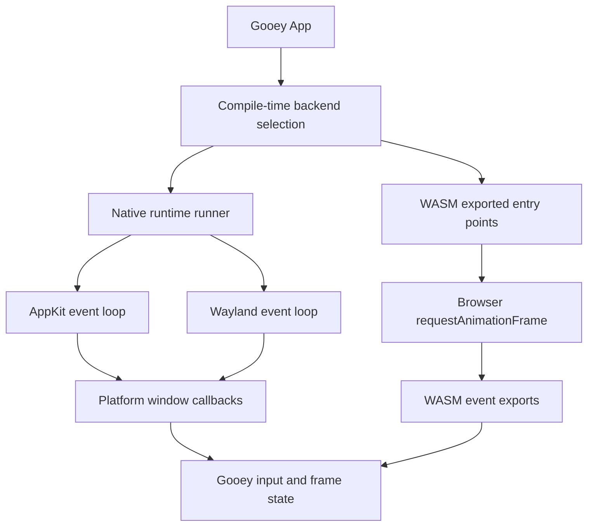
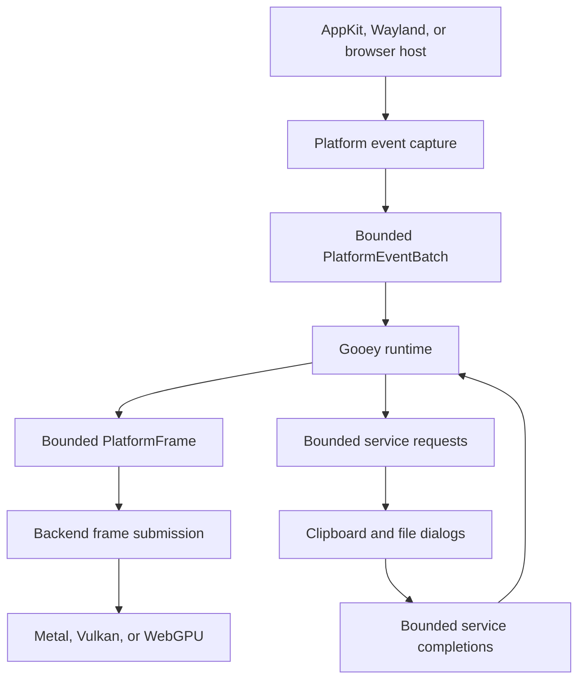

# Platform Interface and Boundary Design

## Status

Partially implemented. This document records the platform architecture, identifies boundary
drift, and defines a staged design for macOS, Linux, WebAssembly, and test backends.

Date: 2026-09-15.

**Phases 1, 2, 3, and the phase 7 test backend are implemented.** Phases 4, 5, and 6 are still
proposals. The per-phase status is recorded in the migration plan below, and anything still
marked proposed is not implemented. Note that the implementation keeps the codebase's existing
`camelCase` method convention rather than the `snake_case` signatures sketched below; renaming
every platform method was out of scope and would have swamped the architectural change.

### What landed

| Area                                 | State                                                |
| ------------------------------------ | ---------------------------------------------------- |
| Platform/window vtables and adapters | Removed                                              |
| `src/platform/contract.zig`          | Exact comptime signature verification                |
| Backend self-pinning                 | `comptime verifyBackend(@This())` per backend        |
| `Platform` lifecycle                 | `initInPlace(self, allocator)`; by-value `init` gone |
| Linux `setupListeners` second phase  | Folded into `initInPlace`, now private               |
| Platform/window lifecycle branches   | Removed from the shared runtime runners              |
| `GlassStyle`                         | One canonical enum; cross-enum cast gone             |
| `getScaleFactor`                     | `f64` on every backend (was `f32` on web)            |
| Window size getters                  | `width`/`height` on every backend                    |
| Callback setters                     | Exact optional types (was `anytype` on web)          |
| Window identity                      | One registry; `PlatformWindow.init` self-registers   |
| Focus policy                         | Published per backend; implicit election removed     |
| `src/testing/test_backend.zig`       | Fixed-capacity headless backend, same contract       |
| `verify*Interface` name-only checks  | Removed (dead, superseded)                           |
| `zig build typecheck-linux`          | New step; analyzes Linux from any host               |

The lifecycle row is narrow on purpose. The platform and window construction, teardown, and
registration branches are gone from `src/runtime/runner.zig` and
`src/runtime/multi_window_app.zig`, but OS-specific branches still exist elsewhere in shared
code; they are listed under [Known gaps](#known-gaps).

### Verification

`zig build`, `zig build test` (1259 tests, as reported by `zig build test --summary all` across
all ten test binaries), `zig build wasm`, and `zig build typecheck-linux` all pass. The Linux
backend has no native CI on the development host, so the `typecheck-linux` step exists to give
it real compiler coverage; it needs Vulkan headers supplied through
`-Dvulkan-headers=<include>`. Without that option the step _skips_ and says so rather than
checking anything, so CI must pass `-Dtypecheck-linux-required=true`, which turns a missing
header path into a hard failure.

### Known gaps

Every item below is still present in the tree. The status table above covers what landed; this
list covers what a reader might otherwise assume landed with it.

OS-specific branches remaining in shared (non-backend) code:

- `src/context/window.zig` `Window.quit()` — a three-way `is_wasm`/`is_linux`/macOS branch that
  writes `w.closed = true` directly and inline-imports `objc` for the macOS arm.
- `src/context/window.zig` — four `if (builtin.os.tag == .macos) platform_window.ns_window` /
  `ns_view` pairs feeding accessibility setup.
- `src/runtime/frame.zig` — `if (comptime !is_wasm)` gating `updateCursorShape`.
- `src/runtime/window_context.zig` — an `is_mac` constant plus four gates around the Metal
  atlas-upload callbacks.
- `src/runtime/render.zig` — six `is_wasm` branches selecting between the browser and native
  image-loading paths.

Other gaps:

- No allocation guard exists in production code. Post-init allocation is reachable through
  `WindowRegistry.register` (`AutoHashMap.put`) and `PlatformWindow.init` (`allocator.create`),
  and `src/examples/multi_window.zig` opens a window from a button handler. A fixed slot map for
  the registry is a prerequisite.
- `PathPromptResult` still owns heap-allocated path slices handed over after initialization
  (`src/platform/interface.zig`), which conflicts with the static-allocation rule.
- Shared code reads `platform_window.size` and `platform_window.scale_factor` as struct fields
  (for example `src/app.zig` in the web frame path) instead of through the contract-verified
  `width`/`height`/`getScaleFactor` methods, so the contract cannot pin those accesses.
- `isRunning()` means different things per backend: `WebPlatform.initInPlace` sets
  `running = true` immediately, while `MacPlatform` and `TestPlatform` only set it inside
  `run()`. Callers cannot use it as a portable "has the loop started" test.
- `platform.drive_model` has no runtime consumer. It is verified by `contract.verifyBackend` and
  documented as phase-4 groundwork; `src/runtime/runner.zig` still unwinds its `defer`s straight
  after `plat.run()`, which is only correct for `blocking_event_loop`.
- Linux `Window.close()` (`src/platform/linux/window.zig`) calls `platform.quit()`, so closing
  one window terminates the whole application.
- Linux `Window.focus()` can only schedule a redraw. Wayland gives the compositor sole
  authority over activation, so raising a window would need `xdg-activation-v1`, and there is no
  capability flag (`can_raise_window`) to express that the request was not honoured.
- `src/platform/web/clipboard.zig` still declares `getText(_: anytype) ?[]const u8`. Clipboard
  is a platform service, so it sits outside the window contract and is unverified until
  phase 6.
- `capabilities.glass_effects` does double duty as a proxy for "this backend has a post-process
  pass" in `src/context/window.zig` `setAccentColor`, which is really a Metal-renderer fact.
- Web `capabilities.custom_cursors` is `false` because `imports.zig` has no cursor binding, and
  `capabilities.clipboard` is write-only there (`clipboard.getText` always returns null).

## Decision summary

1. Compile-time backend selection remains Gooey's canonical platform abstraction.
2. `PlatformVTable` and `WindowVTable` should be removed unless an approved embedding use case
   requires runtime type erasure.
3. Tests should inject a backend at compile time rather than use platform vtables.
4. Platforms may have different host drive models, but must exchange the same bounded event and
   frame data with Gooey.
5. Platform services such as clipboard and file dialogs must be separate from window rendering.
6. Every runtime platform path must use storage reserved during initialization.
7. Unsupported operations, capacity exhaustion, and operating errors must be explicit.

## Goals

- Give Gooey one clear handoff to each supported platform.
- Enforce backend compatibility at compile time with exact signatures.
- Preserve zero-cost dispatch in event, layout, and rendering paths.
- Keep native and web differences explicit without duplicating framework logic.
- Support deterministic headless tests without constructing native windows.
- Reserve all Gooey-owned storage before the event loop or first web frame.
- Bound event capture, frame submission, asynchronous completion, and recovery work.
- Make ownership, failure, and lifecycle transitions visible at call sites.

## Non-goals

- A stable C ABI for third-party platform plugins.
- Runtime switching between AppKit, Wayland, and browser backends.
- Hiding meaningful host differences behind silent no-ops.
- Replacing Metal, Vulkan, or WebGPU with a common third-party graphics library.
- Implementing the future unified `ResourceLimits` API in this design document.

## Architecture before this change

This section describes the boundary as it stood before the phase 1-3 work in the status table
above. It is kept for the rationale, not as a description of the current tree: the vtables,
`.interface()` adapters, and by-value `Platform.init()` referred to below are gone.

`src/platform/mod.zig` selects concrete types at compile time (this part is unchanged):

```text
platform.Platform
├── MacPlatform       macOS
├── LinuxPlatform     Linux
└── WebPlatform       WASM

platform.PlatformWindow
├── macOS Window      AppKit + Metal
├── Linux Window      Wayland + Vulkan
└── WebWindow         canvas + WebGPU
```

The native runtime called the selected concrete types directly in `src/runtime/runner.zig`:

```zig
var platform_instance = try Platform.init();
defer platform_instance.deinit();

var platform_window = try PlatformWindow.init(
    allocator,
    &platform_instance,
    options,
);
defer platform_window.deinit();
```

(`Platform.init()` has since been replaced by `initInPlace(self, allocator)`.)

This is structural compile-time polymorphism. Zig checks only the backend selected for the
current target, and there was no nominal interface shared by every backend — that is what
`src/platform/contract.zig` now provides.

`src/platform/interface.zig` also defined `PlatformVTable` and `WindowVTable`. macOS and Linux
could produce these erased interfaces through `.interface()`; web could not. No production or
test consumer used either vtable, which is why phase 2 removed them.

### Control flow



The different host entry mechanisms are legitimate. The duplicated event and rendering paths
behind them are the problem.

## Boundary problems before this change

These are the problems the design set out to fix. Each one is marked with its current state;
the ones still open are collected under [Known gaps](#known-gaps).

### Two contracts can drift — fixed

The concrete compile-time API and the optional vtables described overlapping contracts. They
already differed:

- Web did not provide `.interface()` adapters.
- `WindowVTable.getScaleFactor` returned `f64`, while `WebWindow.getScaleFactor` returned `f32`.
- The runtime used concrete methods that were absent from the vtables.
- Vtable support was maintained without a caller that validated its behavior.

An unused second contract adds maintenance cost without improving safety or testability, so the
vtables were removed in phase 2.

### Interface verification checks names, not signatures — fixed for the platform boundary

`src/core/interface_verify.zig` uses `@hasDecl`. The platform verifier checks only `init` and
`deinit`; the window verifier checks only `getSize` and `setTitle`.

The file-dialog verifier accepts a mock whose `promptForPaths` returns `?void`, despite the
documented result being `?PathPromptResult`. The renderer verifier intentionally permits
unrelated call signatures.

These checks do not prove that shared runtime code can call every backend correctly.
`src/platform/contract.zig` now checks complete function types for `Platform` and
`PlatformWindow`; the duck-typed checks in `src/core/interface_verify.zig` still cover the
other subsystems.

### Platform details leak into shared runtime code — partially fixed

`src/runtime/runner.zig` contained Linux-only branches for listener setup and active-window
registration. This made the runtime responsible for Wayland initialization order. Those
branches are gone, but other OS-specific branches remain in shared code (see Known gaps).

Backend-specific setup should occur behind a common lifecycle operation. Shared runtime code
should not know which protocol requires listeners or registration.

### Web uses compatibility no-ops — partially fixed

`WebWindow` provides no-op methods for callbacks, scenes, atlases, close operations, and other
native concepts. Web rendering is managed separately by `WebApp`.

A no-op is safe only when omission is semantically equivalent to success. Ignoring a scene or
an operation that a caller expects to take effect is not equivalent.

### Services are mixed into the platform object — outstanding

Clipboard and file-dialog behavior is not part of event-loop ownership. Combining these
services with `Platform` makes differences harder to model:

- Native dialogs may block or use an operating-system completion callback.
- Browser dialogs and downloads are asynchronous.
- Clipboard APIs have different permission and user-gesture requirements.
- Current result types allocate and transfer ownership after initialization.

These services need their own bounded request and completion contracts.

### Runtime allocation remains in platform-facing APIs — outstanding

`PathPromptResult` owns dynamically allocated path slices. Current examples call dialogs with
`std.heap.page_allocator` from application event handlers. Test clipboard and dialog mocks also
allocate during simulated operations.

This conflicts with the rule that Gooey-owned storage must be reserved before the native event
loop or first web frame. Platform results must write into caller-provided bounded storage or
preallocated request slots.

### Capacity failure can be mistaken for optional absence — outstanding

Several platform-facing APIs use `null` for cancellation, unsupported behavior, allocation
failure, and operating-system failure. Those states require different application responses.

The existing deferred-command queue also warns and drops work on exhaustion. The platform
boundary must not copy that behavior. Capacity exhaustion must fail fast with the resource
name, configured capacity, requested count, and operation context.

## Target boundary

The target architecture separates host control, bounded data transfer, and optional services:



### Ownership by layer

| Layer             | Owns                                              | Must not own            |
| ----------------- | ------------------------------------------------- | ----------------------- |
| Gooey application | State and declared resource budget                | Native handles          |
| Gooey runtime     | Frames, dispatch, event draining, work limits     | OS protocol details     |
| Platform          | Host lifecycle, native handles, raw event capture | Widget state            |
| Platform window   | Surface, scale, cursor, IME bridge                | Application callbacks   |
| Renderer backend  | GPU resources and frame submission                | Layout or widget policy |
| Platform services | Bounded requests and completions                  | Render scheduling       |

## Canonical compile-time contract

The exact Zig signatures should be finalized during implementation. The following shape records
responsibilities and call direction, not an implemented API.

### Backend namespace

Each backend should expose one namespace with the same declarations:

```zig
pub const Backend = struct {
    pub const Platform = ...;
    pub const PlatformWindow = ...;
    pub const Renderer = ...;
    pub const drive_model: DriveModel = ...;
    pub const capabilities: PlatformCapabilities = ...;
};
```

`platform/mod.zig` should select a backend namespace once and derive public aliases from it.
Backend files should not independently invent aliases or option types.

### Platform lifecycle

```zig
pub noinline fn init_in_place(
    self: *Platform,
    allocator: std.mem.Allocator,
    limits: *const PlatformLimits,
) PlatformInitError!void;

pub fn deinit(self: *Platform) void;

pub fn run(self: *Platform, runtime: *RuntimeBridge) PlatformRunError!void;

pub fn request_quit(self: *Platform) void;
```

Required properties:

- The final address is established before callbacks or native listeners retain `self`.
- Initialization reserves every platform-owned queue, pool, and staging buffer.
- Partial initialization unwinds every acquired resource with `errdefer`.
- `run` performs bounded work per event-loop iteration.
- `request_quit` is safe from every documented lifecycle state.

### Host drive model

Native and web execution should not be forced into a false common event-loop implementation:

```zig
pub const DriveModel = enum(u8) {
    blocking_event_loop,
    host_callback,
};
```

- macOS and Linux use `blocking_event_loop`.
- Web uses `host_callback` through exported browser entry points.
- Both models feed the same `PlatformEventBatch` and consume the same `PlatformFrame`.

The drive model is a compile-time backend property. It is not runtime dynamic dispatch.

### Platform window

```zig
pub noinline fn init_in_place(
    self: *PlatformWindow,
    platform: *Platform,
    limits: *const PlatformWindowLimits,
    options: *const WindowOptions,
) PlatformWindowInitError!void;

pub fn deinit(self: *PlatformWindow) void;

pub fn size(self: *const PlatformWindow) geometry.Size(f64);
pub fn scale_factor(self: *const PlatformWindow) f64;
pub fn set_title(self: *PlatformWindow, title: []const u8) PlatformWindowError!void;
pub fn set_cursor(self: *PlatformWindow, cursor: CursorShape) PlatformWindowError!void;
pub fn request_frame(self: *PlatformWindow) PlatformWindowError!void;
```

Window registration belongs inside initialization or a common platform operation. The native
runtime must not contain a Linux-only registration branch.

Meaningful unsupported operations must return `error.Unsupported` or be absent from the common
contract. Platform-specific features belong in explicit platform namespaces.

### Event capture

Native callbacks and WASM exports should translate raw input into one bounded event type:

```zig
pub const PlatformEvent = union(enum) {
    close_requested,
    redraw_requested,
    resized: ResizeEvent,
    scale_changed: ScaleChangedEvent,
    pointer_moved: PointerMovedEvent,
    pointer_button: PointerButtonEvent,
    scrolled: ScrollEvent,
    key_changed: KeyChangedEvent,
    text_input: TextInputEvent,
    composition: CompositionEvent,
};
```

`PlatformEventBatch` must use fixed storage reserved during initialization. It must expose:

- Event capacity.
- Current event count.
- Maximum events drained per frame.
- Explicit overflow failure.
- A monotonically increasing batch or host-event sequence.

External callbacks only capture and validate events. Gooey processes the batch later on its own
control path. This prevents hidden reentrancy and bounds work per frame.

### Frame submission

Gooey should hand each renderer one bounded, immutable frame description:

```zig
pub fn submit_frame(
    renderer: *Renderer,
    window: *PlatformWindow,
    frame: *const PlatformFrame,
) FrameSubmitError!void;
```

`PlatformFrame` should contain bounded slices or indices for:

- Render commands.
- Vertices and indices.
- Draw batches.
- Clip records.
- Glyph and image atlas updates.
- Texture upload ranges.
- Clear color and viewport state.

The platform renderer may translate these records to Metal, Vulkan, or WebGPU commands. It must
not call back into layout, widgets, or application state.

Web must consume this frame contract rather than treating `setScene` as a no-op. Differences in
GPU encoding remain inside the renderer backend.

### Platform services

Clipboard and file dialogs should be independent service types or namespaces:

```zig
pub const PlatformServices = struct {
    clipboard: ClipboardService,
    file_dialogs: FileDialogService,
};
```

Requests and completions must use preallocated slots. A result should identify cancellation
separately from failure:

```zig
pub const FileDialogCompletion = union(enum) {
    cancelled,
    selected: PathSelection,
    failed: FileDialogError,
};
```

`PathSelection` should reference storage owned by the request slot or write into an application
buffer supplied when the request is created. It must not allocate path arrays on completion.

Browser user-gesture requirements and native modal behavior should be explicit capabilities or
errors, not silent no-ops.

## Exact contract verification

A verifier must check complete function types, not only declaration names. Each backend should
instantiate it in a compile-time block.

Conceptually:

```zig
pub fn verify_backend(comptime Backend: type) void {
    verify_platform(Backend.Platform);
    verify_platform_window(Backend.Platform, Backend.PlatformWindow);
    verify_renderer(Backend.Renderer, Backend.PlatformWindow);
    verify_drive_model(Backend.drive_model);
}
```

The verifier must check:

- Required declarations.
- Parameter types and order.
- Receiver mutability.
- Error unions and payload types.
- Numeric widths.
- Capability and drive-model declarations.
- Important type-size and alignment relationships.

Each target must instantiate verification for its selected production backend. A target-neutral
`TestBackend` must pass the same verifier.

## Test architecture

### Compile-time test backend injection

Tests need backend substitution, but do not need runtime platform switching:

```zig
pub fn Runner(comptime Backend: type) type {
    comptime verify_backend(Backend);

    return struct {
        platform: Backend.Platform,
        window: Backend.PlatformWindow,
        renderer: Backend.Renderer,
    };
}
```

Production instantiates `Runner(platform.backend)`. Headless tests instantiate
`Runner(testing.TestBackend)`. Calls remain direct and statically dispatched.

### Test backend requirements

`TestBackend` must model production constraints rather than provide convenient unbounded mocks:

- Fixed window slots.
- Fixed event and completion queues.
- Fixed clipboard and path buffers.
- Fixed frame-submission records.
- Configurable failure at every fallible boundary.
- No allocation after `init_in_place` returns.
- Explicit lifecycle state.
- Deterministic event and frame sequence numbers.

The backend should record only bounded information required by assertions. It must fail fast
when recording capacity is exhausted.

### Shared backend contract suite

The same generic suite should test every backend where host APIs permit:

- Minimum and maximum configured capacities.
- Exactly-full event, request, completion, and frame queues.
- One-past-capacity failure.
- Initialization failure after each acquired resource.
- Repeated slot release and reuse.
- Window registration and removal.
- Empty event batches and maximum-sized batches.
- Quit before run, during run, and after shutdown begins.
- Maximum framebuffer dimensions and one-past-maximum rejection.
- Unsupported operations.
- Deterministic event ordering.
- Unused-byte zeroing before GPU or host submission.
- No Gooey allocation after initialization.

Native integration tests should separately cover AppKit, Wayland, Metal, and Vulkan behavior that
cannot run headlessly. Browser tests should cover exported callbacks, resize, device-pixel ratio,
and WebGPU submission in a controlled browser runner.

### Invalid partial fixtures

Tests should not construct a large production object with unrelated fields set to `undefined`.
Small fixed-capacity subsystems, such as the deferred-command queue, should be extracted and
tested as valid independently initialized values.

This reduces fixture fragility and lets capacity, reuse, and zeroing tests target the real owner
of each invariant.

## Preliminary resource sketch

Final values must come from the application resource budget and framework ceilings. This table
identifies the required dimensions without claiming that the unified `ResourceLimits` API
already exists.

| Resource         | Resident storage                            | Work bound                        |
| ---------------- | ------------------------------------------- | --------------------------------- |
| Platform events  | `event_count_max * sizeof(PlatformEvent)`   | `event_count_frame_max`           |
| Native windows   | `window_count_max * sizeof(PlatformWindow)` | Bounded registry scan             |
| Render commands  | Preallocated command array                  | `render_command_count_frame_max`  |
| Vertices         | Preallocated vertex array                   | `vertex_count_frame_max`          |
| Indices          | Preallocated index array                    | `index_count_frame_max`           |
| Draw batches     | Preallocated batch array                    | `draw_batch_count_frame_max`      |
| Texture uploads  | Preallocated staging bytes                  | `texture_upload_bytes_frame_max`  |
| Service requests | Fixed request slots                         | `service_request_count_frame_max` |
| Completions      | Fixed completion slots                      | `completion_count_frame_max`      |
| Path data        | Fixed UTF-8 byte storage                    | `path_bytes_request_max`          |

Expected locality:

- Events are appended and drained sequentially.
- Frame records are produced and consumed sequentially.
- GPU upload ranges are coalesced before submission.
- Request and completion slots use stable indices rather than pointers into growable storage.
- Hot submission loops receive primitive arguments and bounded slices, not `self` graphs.

The implementation design must add concrete byte totals, worst-case per-frame operations, and
platform-specific GPU memory before code is merged.

## Delineation fixes

### Files and responsibilities

The intended direction is:

```text
src/platform/
├── mod.zig                 # Selects and verifies one backend.
├── contract.zig            # Shared types and exact compile-time verification.
├── event.zig               # Bounded event records and batch rules.
├── frame.zig               # Immutable platform frame handoff.
├── services.zig            # Shared request and completion types.
├── macos/                  # AppKit, Metal, CoreText, native services.
├── linux/                  # Wayland, Vulkan, native services.
└── web/                    # Browser imports, WebGPU, browser services.

src/testing/
└── test_backend.zig        # Fixed-capacity backend passing the same contract.
```

This is a responsibility sketch, not an instruction to move files before the contract is
proven. Existing modules should move only when their ownership becomes clearer.

### Framework-to-platform calls

The framework may call the platform to:

- Initialize and stop the host integration.
- Create and destroy bounded window slots.
- Request a frame.
- Update native window properties.
- Submit one immutable frame.
- Enqueue a bounded service request.

The platform may communicate back only by:

- Appending validated events to the event batch.
- Appending service completions to the completion queue.
- Updating explicitly shared lifecycle flags with documented synchronization.

The platform must not invoke arbitrary application callbacks from native callbacks or GPU
completion handlers.

## Migration plan

### Phase 1: Pin the current contract — implemented

- Add exact compile-time checks for current platform and window calls.
- Instantiate checks for macOS, Linux, and web in their target builds.
- Normalize scalar types, beginning with scale factor.
- Add compile failures for signature drift where practical.
- Do not add new vtable methods while this work is in progress.

Done when every selected backend satisfies one exact current-call contract.

### Phase 2: Remove unused runtime interfaces — implemented

- Remove `PlatformVTable`, `WindowVTable`, and `makePlatformVTable`.
- Remove native `.interface()` producers.
- Update documentation that claims runtime platform switching is supported.
- Retain other vtables only where a concrete bounded use case exists.

Done when no platform abstraction has two overlapping contracts.

### Phase 3: Normalize lifecycle and ownership — implemented

- Convert large or address-sensitive platform values to `init_in_place`.
- Move Linux listener setup and registration behind common initialization.
- Validate all runtime platform limits during initialization.
- Add lifecycle assertions at initialization, running, and deinitialization boundaries.

Still outstanding in this phase:

- Add allocation-guard coverage around post-initialization platform paths. No such guard exists
  in production code; the only lifecycle guard is the one in `src/testing/test_backend.zig`.
  Post-init allocation is live and reachable, so a guard would fail today rather than pass:
  `WindowRegistry.register` calls `AutoHashMap.put`, `PlatformWindow.init` calls
  `allocator.create`, and `src/examples/multi_window.zig` opens a window from a button handler.
  The registry would need a fixed slot map before the guard can be switched on.

Done when shared runtime code has no OS-specific lifecycle branches.

### Phase 4: Introduce bounded event batches — proposed

Not implemented. Native input still reaches the framework through per-window callback function
pointers plus a `*anyopaque` back-pointer, and web still drains its own JS ring buffers, so the
two paths remain disjoint. `PlatformEvent` and `PlatformEventBatch` do not exist.

- Define the common event representation.
- Reserve event storage during initialization.
- Translate AppKit, Wayland, and browser events into the same batch.
- Bound capture and drain work independently.
- Fail fast on overflow with structured capacity context.

Done when native callbacks and WASM exports do not call framework behavior directly.

### Phase 5: Introduce the frame submission boundary — proposed

Not implemented. The handoff is still `setScene(*const Scene)` plus atlas setters, and web
still bypasses it entirely. `PlatformFrame` and `submit_frame` do not exist. The contract pins
the current scene-pointer handoff so it cannot drift further in the meantime.

- Define the immutable, bounded `PlatformFrame`.
- Move Metal and Vulkan submission behind `submit_frame`.
- Move web rendering onto the same logical frame contract.
- Remove scene and atlas compatibility no-ops.
- Verify staging ranges and zero unused bytes before submission.

Done when all GPU backends consume equivalent frame data from one framework path.

### Phase 6: Separate platform services — proposed

Not implemented. `PathPromptResult` still owns heap-allocated path slices and transfers
ownership on completion, which still conflicts with the static-allocation rule. Clipboard and
file dialogs remain attached to the platform rather than separate services.

- Replace allocating path results with bounded request-slot storage.
- Separate cancellation, unsupported behavior, capacity exhaustion, and operating errors.
- Model browser user-gesture restrictions explicitly.
- Add clipboard and dialog capacity tests.

Done when service completion performs no Gooey allocation and cannot silently lose failure
information.

### Phase 7: Complete test and CI coverage — partially implemented

`src/testing/test_backend.zig` exists and passes the same `verifyBackend` contract as the three
production backends, with fixed capacities, explicit lifecycle state, injectable failure at
every fallible boundary, fail-fast recording, and exact-capacity tests. `zig build
typecheck-linux` gives the Linux backend compiler coverage from a non-Linux host. Still
outstanding: a generic suite instantiated against _every_ backend, WASM contract tests, and a
browser integration runner.

- Add `TestBackend` and shared backend contract tests.
- Replace partial `Window` fixtures with focused valid subsystem fixtures.
- Run native contract and integration tests on macOS and Linux.
- Add WASM contract tests and a minimal browser integration runner.
- Keep Valgrind, fuzzing, formatting, and allocation regression gates required.

Done when every backend passes exact contract checks and every common boundary invariant is
exercised by the headless backend.

## Acceptance criteria

The platform redesign is complete when:

- One compile-time contract defines the platform boundary.
- No unused runtime platform vtables remain.
- macOS, Linux, web, and `TestBackend` pass exact contract verification.
- Shared runtime code contains no OS-specific setup branches.
- All host input enters a bounded event batch.
- All renderers consume one bounded frame representation.
- Runtime platform and service operations perform no Gooey allocation.
- Capacity exhaustion fails fast with actionable context.
- Cancellation and unsupported behavior are distinct from operating failure.
- Browser differences are explicit through the drive model and capabilities.
- Platform hot loops contain no dynamic dispatch, allocation, or unbounded work.
- Initialization and recovery paths have error and partial-cleanup tests.
- Native, WASM, formatting, leak, and focused performance validation pass.

## Open decisions before implementation

1. Whether `PlatformFrame` should reference the existing `Scene` storage or a lower-level frozen
   command representation.
2. Whether service requests share one completion queue or use one queue per service.
3. Which platform limits specialize type sizes at compile time and which require exact runtime
   allocation during initialization.
4. How device loss and surface recreation consume preallocated replacement resources without
   violating the no-replacement rule.
5. Whether a future embedding API needs a stable C ABI. If so, it should be designed separately
   from the internal platform contract and justified with an actual consumer.
